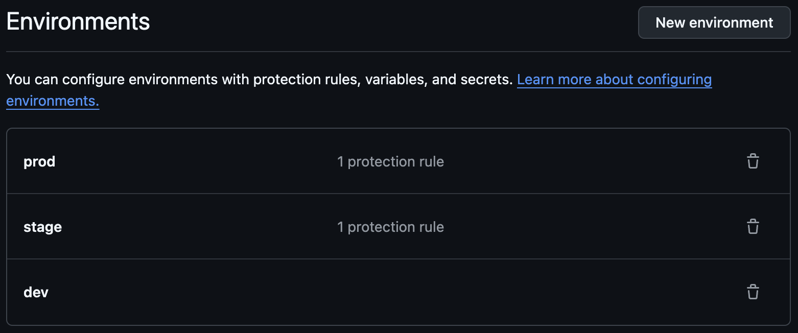
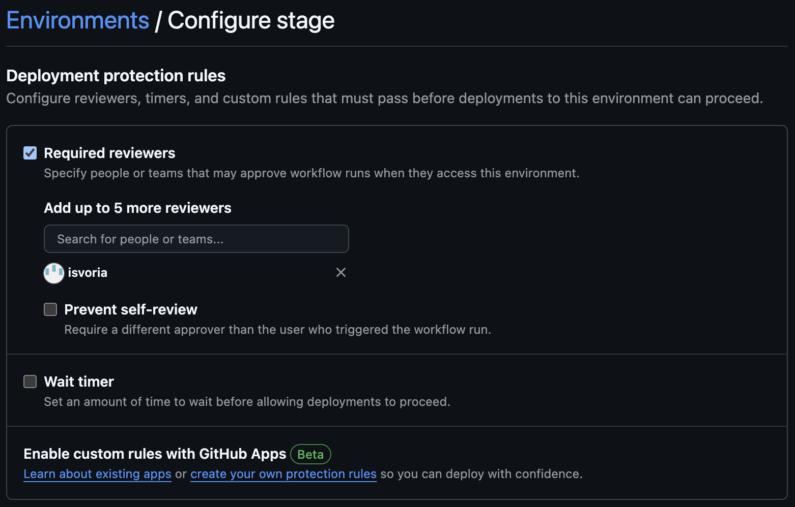
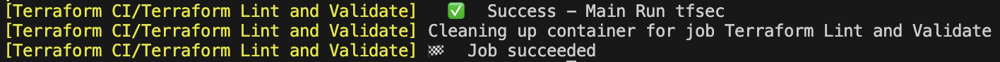
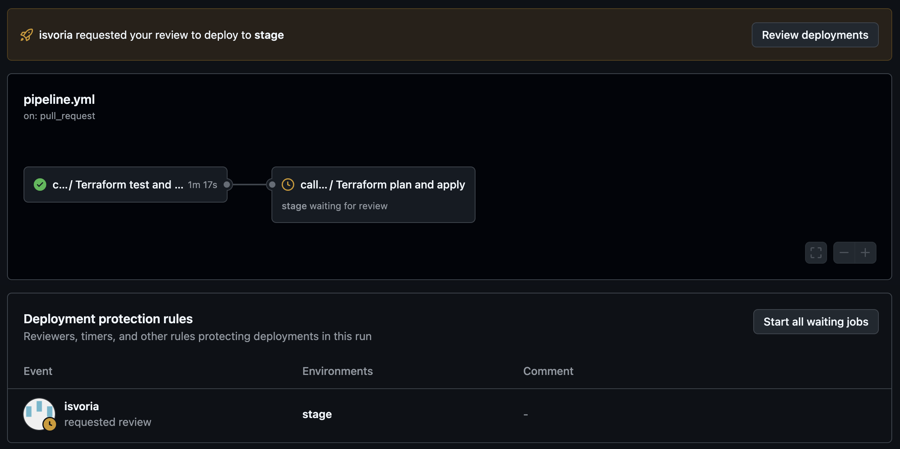
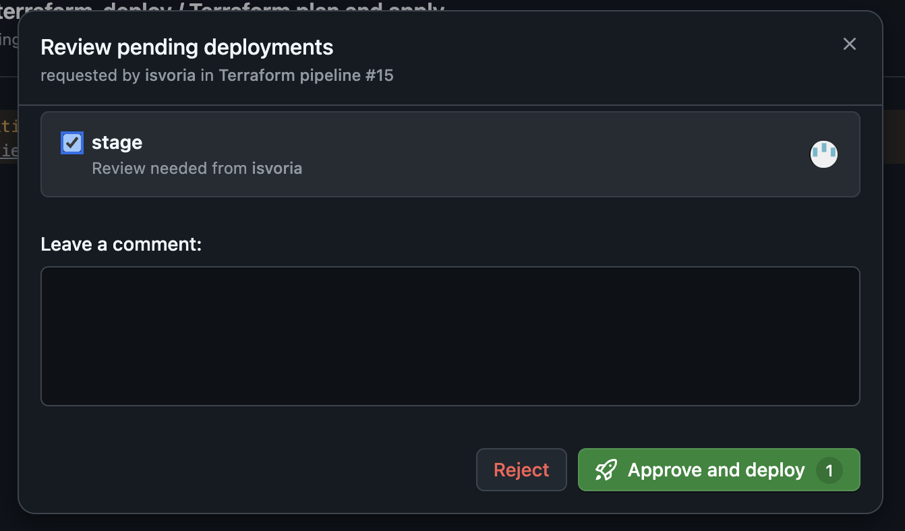
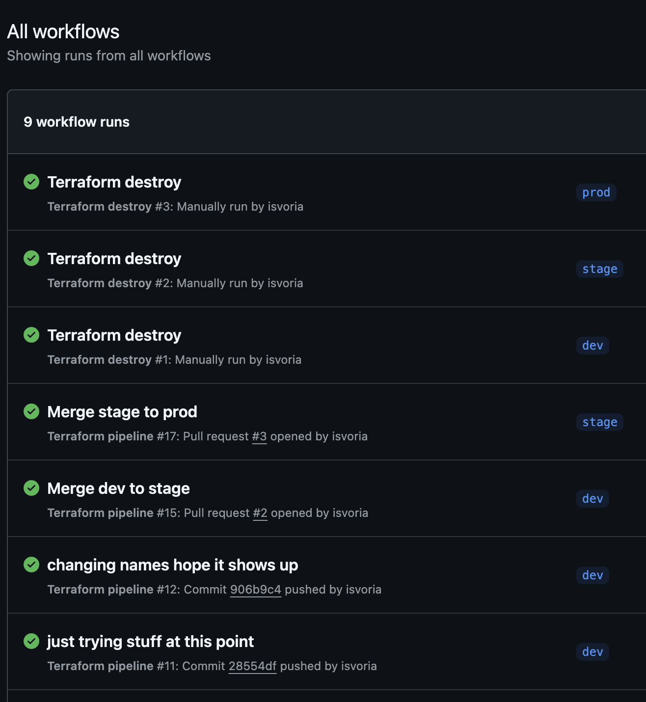

# Report

## The Goal

The primary goal was to achieve secure infrastructure deployment with minimal amount of code. Using best practices to answer the assignment both in terms of CI/CD pipeline and the infrastructure. 

## Chosen folder structure and justification

### Folder structure choice: alternative 2

#### Justification theory
- **Alternative 1**: Offers flexibility but introduces redundancy when managing workspaces or Git branches.
- **Alternative 2**: Provides a simpler, centralized project structure. While it doesn't support independent deployment of individual components, it fits this project's needs. 
- **Alternative 3**: Allows independent component deployment but increases complexity and risks code redundancy. But might be the most flexible one.

For this project, I chose **Alternative 2** since individual component management isn’t required. However, for larger projects, **Alternative 3** could be beneficial for independently managing environments. However in this case i hope git branches and terraform workspaces can take care of this concern.

I might be wrong, but time will tell.

## Challenges faced during implementation and solutions

### Challenges and solutions iac

1. **Deployment access control**:
   - *Issue*: Anyone with access could deploy to production without proper validation. Skipping GitHub Actions and using direct Terraform workspaces to apply the infrastructure.
   - *Solution*: An implementation could be **Role-Based Access Control (RBAC)** to assign different service principles for `prod` and `stage`. These could be  securely stored in GitHub environment secrets and not given to none admin developers. This was not implemented but it was something that bugged my mind think about.

2. **Workspace and variable mismatch**:
   - *Issue*: It was possible to have mismatched states, e.g., being in `dev` workspace, on `stage` Git branch, and using `prod` variables.
   - *Solution*: You can have automated checks in the CI/CD pipeline to ensure that only the correct combination of workspace, branch, and variable files are used. But this does not validate direct access to apply the infrastructure with terraform and not CI/CD, enterprise tools like **HashiCorp Sentinel** or **Open Policy Agent (OPA)** for policy could enforcement to prevent manual misuse. I think also Jitter was mentioned? Or the RBAC as mentioned earlier. But not any concern for this assignment.

3. **No use for global folder**:
   - *Issue*: I did not use global folder.
   - *Observation*: Although using `locals` could be placed inside the global folder i did not use any locals for this project. Everything is defined inside deployment/main.tf and that file is not very complex either.

4. **Backend configuration**:
   - *Issue*: Unable to set up a separate backend per environment since backend settings are defined during `terraform init`.
   - *Solution*: Leveraged **Terraform workspaces** to maintain separate states within the same backend. Although a bigger project might want separate backends all together.

### Challenges and solutions CI/CD

1. **Understanding the different envs**:
   - *Issue*: Github have branches and environments, then you also have 
   - *Observation*: It was a bit hard understanding how all should work together i spent some time trying figuring out, but eventually i got i worked out. Terraform workspace controls the backend state file. GitHub environment control where you deploy your code and git branch can control what environment you use, but this can be determined in any yml file. Environment rules determine CI/CD jobs/rules. And brach rules affect push / pull request naturally. 

2. **Using act**:
   - *Issue*: I wanted to test the GitHubs actions before i started pushed them to origin.
   - *Solution*: act let me do this and it worked flawlessly. however i did not prepare or look for a custom docker image with az so it would be the same as on github actions, this made me have to do a small workaround in the yml file.

3. **tfvars files**:
   - *Issue*: This might have been the biggest issue, where should the .tfvars files go? Should they be in repo - are they even sensitive?
   - *Solution*: I decided the .tfvars vas sensitive so i placed them in .gitignore and made a enviroment secret of the files in github actions. To use them in my workflow i did this:
  
   ```yml
   name: Create tfvars file
     working-directory: ./deployments
      run: |
         printf "%s" "$TFVARS_CONTENT" > ${{ github.event.inputs.environment }}.tfvars
      env:
         TFVARS_CONTENT: ${{ secrets.TFVARS_CONTENT }}
   ```

   but there are multiple more elegant solutions than this, but this worked for now.

## Final thoughts

None of my problems was actually with the file structure i chose, so i think i chose a good minimal file structure,however i never used the global folder, and i did not use locals. The implications of this i do not really know. I also assume that there are better folder structures than this, but at least it worked with a solo developer.

As mentioned by Tor Ivar "... the focus in this course is on practicing deployment, not maintaining long-running environments." it still bugs me that i do not really know how to take care of persistent data and files / the content of the upgrades and how to use the infrastructure long term and backups. But i guess its just a practice of automate data migration to ensure continuity.. 

# Results


 Requiring review on an environment means that if a workflow job specifies the environment, it will pause before the job and wait for approval.

It might be important to ensure the github actions uses the correct workspace, if the branches have the same names as workspaces we can use github.base_ref or github.ref_name to synchronous all three names (branch, env, workspace).

There are a three workflows in this solution.

Terraform test and validate
Terraform plan and apply
Terraform destroy

Destroy is manually triggered in github. Test and validate and plan and apply is combined into a single pipeline which is triggered on push or pr to dev, stage or 

The test and validate checks, fmt, validate, tfsec and tflint and they all pass both on github actions and using act.


 
here are some screenshots from github actions:

Waiting for approval when PR into stage or prod:



Successful github actions runs:

